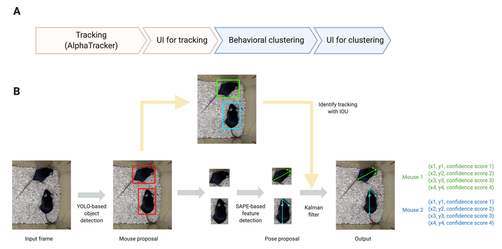

## AlphaTracker
[AlphaTracker](https://github.com/ZexinChen/algorithm) is a Multi-Animal Pose Tracking and behavioral analysis tool which incorporates **multi-animal tracking**, **pose estimation** and **unsupervised behavioral clustering** to empower system neuroscience research. Alphatracker achieves the state-of-art accuracy of multi-animal tracking which lays the foundation for stringent biological studies. Moreover, the minimum requirement for hardware (regular webcams) and efficient training procedure allows readily adoption by most neuroscience labs.

     
    Architecture and Pipeline of AlphaTracker

## instructions

[Multi-animal Pose Estimation and Tracking](https://github.com/RuihanZhang2015/AlphaTracker/blob/master/Manual/01%20Tracking.md)

[Unsupervised Behavioral Clustering](https://github.com/RuihanZhang2015/AlphaTracker/blob/master/Manual/02%20Behavioral%20Clustering.md)

[Tracking UI and Clustering UI](https://github.com/RuihanZhang2015/AlphaTracker/blob/master/Manual/03%20UI.md)
